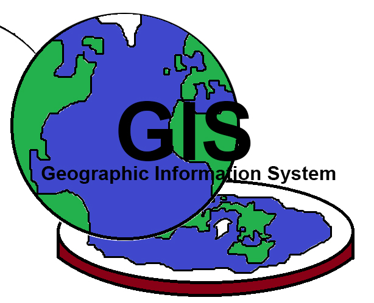
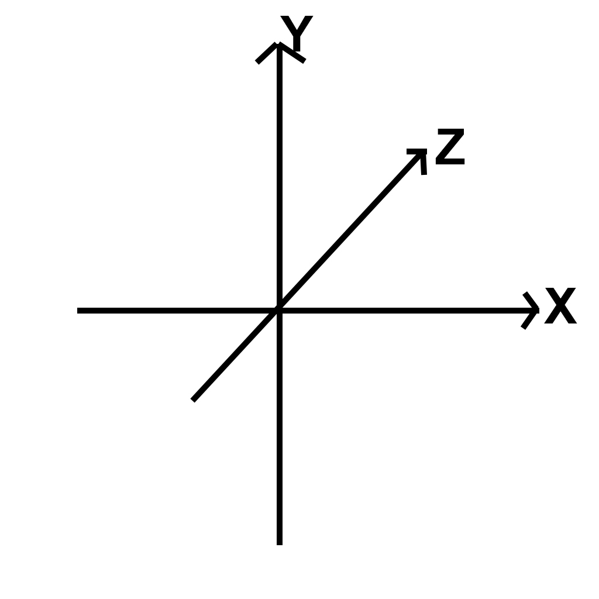
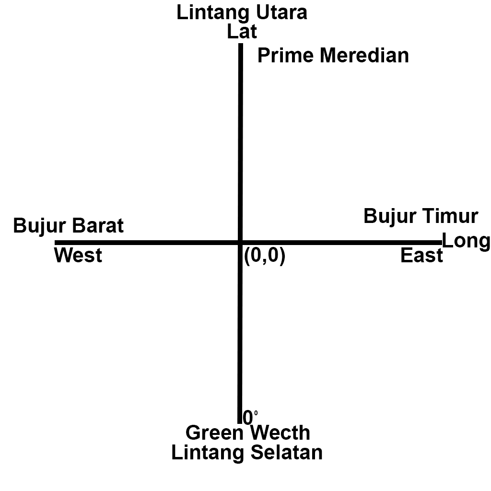

**Rangkuman Pertemuan 1 Sistem Informasi Geografis**

  

**Latar Belakang Masalah**

1. Apa itu Sistem Informasi Geografis?
2. Apa aplikasi yang digunakan dalam Sistem Informasi Geografis?
3. Apa itu Geospacial?
4. Apa itu Koordinat?

Sistem = alur, plot, cerita, tata cara

Informasi = hasil pengolahan data

Geografis = grafis, bentuk bumi

Jadi kesimpulannya Sistem Informasi Geografis adalah alur yang menerangkan atau menjelaskan hasil pengolahan data pada bentuk bumi

Pada Sistem Informasi Geografis menggunakan aplikasi QGIS

Pada sistem informasi geografis terdapat geospacial yang bias disebut juga Ruang (x,y,z), untuk gambarnya seperti dibawah :

  

Pada sistem informasi geografis juga terdapat koordinat(lat, long), jadi ada titik (0,0) ada 0 derajat, untuk 0 derajat itu sendiri berada di inggris, tepatnya di greenwetch, kemudian pada lintang utara ada prime meridian atau yang disebut juga garis bujur dalam sistem koordinat geografis, untuk gambarnya seperti dibawah:

  

**Penutup**

Kesimpulan

Kesimpulan dari pertemuan pertama adalah untuk mengetahui pengertian serta fungsi dari Sistem Informasi Geografis dan aplikasi yang digunakan dalam pembelajaran  Sistem Informasi Geografis.

Saran

Saran saya pada pertemuan selanjutnya lebih baik kita langsung praktek agar kita dapat langsung mengetahui apa itu Sistem Informasi Geografis

* Nama : Maizar Fernando	
* NPM : 1144109
* Kelas : 3C
* Prodi : D4 Teknik Informatika
* Mata Kuliah : Sistem Informasi Geografis

Link Github : https://github.com/maizar08/sisteminformasigeografis

Referensi : https://rizaldicaprio.wordpress.com/tim-gis/

Scan Plagiarisme

1. smallseotools - Link https://drive.google.com/open?id=0B5gySyqZ4GGoMUZrSDBTTGYxSzQ
2. serachenginereport - Link https://drive.google.com/open?id=0B5gySyqZ4GGoTUhFR1RzN19DTG8
