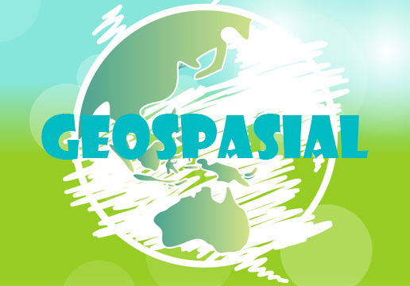
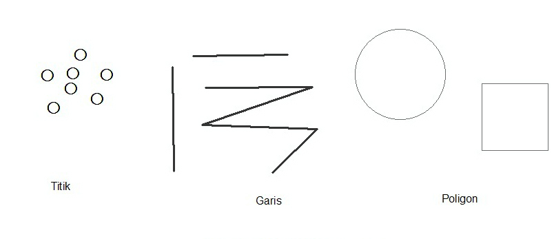
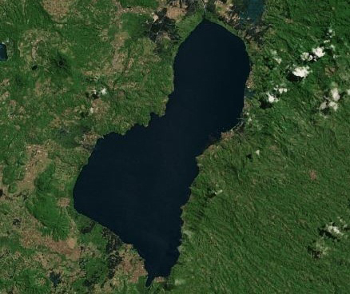

**Rangkuman Pertemuan 2 Sistem Informasi Geografis**

  

Latar Belakang Masalah

Dari gambaran bumi yang kita lihat selama ini, kita bisa melihat air, gunung, lautan, jalanan dan objek – objek lainnya. Semua itu adalah bagian dari data geospasial, pada geospasial itu sendiri terdapat 2 macam model data yaitu data raster dan data vektor.

1. Apa itu data vektor pada Geospasial?
2. Apa itu data raster pada Geospasial?

Data Vektor adalah sebuah data yang menampilkan pola titik, kurva, garis atau polygon. Data vektor ini sangat cocok untuk mempresentasikan jaringan jalan, gedung dan letak koordinat.

  

Data vektor hanya memerlukan ruang penyimpanan yang sedikit dan memiliki skala spasial yang tinggi

Data vektor juga tidak mudah untuk dimanipulasi serta memiliki struktur data yang kompleks

Data Raster adalah sebuah data yang menampilkan bentuk ruang bumi dalam bentuk pixel yang membentuk petak dan dihasilkan dari penginderaan jauh, jadi resolusi gambar yang dihasilkan tergantung oleh jumlah pixelnya

  

Data raster mudah untuk dimanipulasi dengan fungsi matematik sederhana serta memiliki struktur data yang sederhana

Data raster juga memerlukan tempat penyimpanan yang besar dan hasil gambar tergantung dengan ukuran pixelnya

Penutup

Kesimpulan
Jadi dapat disimpulkan bahwa data vektor dan data raster memiliki kekurangan dan kelebihannya masing – masing serta memiliki proses yang berbeda – beda dalam mempresentasikan atau menampilkan bentuk bumi

Saran
Saran saya sebaiknya pembelajaran tentang data geospasial ini lebih dijelaskan lagi agar kita dapat lebih memahami apa itu data geospasial teruta data vektor dan data raster

* Nama : Maizar Fernando
* NPM : 1144109
* Kelas : 3C
* Prodi : D4 Teknik Informatika
* Mata Kuliah : Sistem Informasi Geografis

Link Github : https://github.com/maizar08/sisteminformasigeografis

Referensi : http://geograph88.blogspot.co.id/2014/12/data-raster-dan-data-vektor.html

Scan Plagiarisme

1. smallseotools - Link https://drive.google.com/open?id=0B5gySyqZ4GGoN0lENDZsU0ZuaTQ
2. duplichecker - Link https://drive.google.com/open?id=0B5gySyqZ4GGoaHRtdHVGSzlXdWM