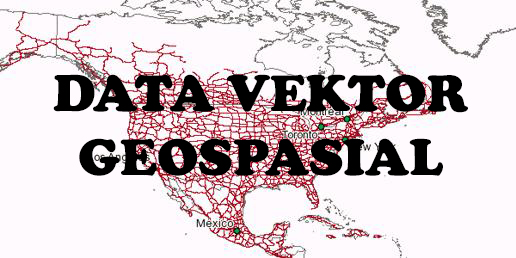

**Rangkuman Pertemuan 3 Sistem Informasi Geografis**

  

Latar Belakang Masalah

Didalam sistem informasi geografis terdapat 2 format data spasial yaitu data vektor geosapsial dan data raster geospasial. Data vektor disini dapat mempresentasikan bumi sebagai sebuah garis , polygon dan titik, dengan menggunakan beberapa langkah praktikum kita dapat mencari info tentang jumlah seperti jumlah kota yang ada pada beberapa lokasi dengan menggunakan penerapan data vektor ini.

1. Apa yang ada didalam data vektor?
2. Apa fungsi dari Shapefile/shp?
3. Apa yang harus digunakan untuk melihat jumlah shapefile?
4. Apa contoh method yang ada pada shapefile?
5. Apa saja yang diperlukan untuk melhat jumlah shapefile?

Data vektor adalah seperti yang dijelaskan diatas adalah suatu data yang dapat mempresentasikan bumi sebagai mozaik garis, titik dan polygon. Di dalam data vektor ini sendiri terdapat class, salah satunya shapefile atau shp.

Dengan menggunakan shapefile ini kita bisa melakukan perhitungan jumlalnya seperti menghitung jumlah kota yang ada pada ruang lingkup tertentu menggunakan beberapa sistem.

Sistem yang digunakan untuk melakukan perhitungan ataupun melihat shapefile disini kita menggunakan python karena tergolong mudah dalam penggunaannya.

Pada shapefile atau shp disini juga terdapat beberapa method, sebagai contohnya ada method Reader dan shape. Untuk method Reader itu sendiri berfungsi untuk membaca data yang ada pada file shp, contoh **shapefile.Reader(&quot;shp/gilang.shp&quot;).** dari codingan tersebut berarti kita bisa mendapatkan output, yaitu hasil atau data yang ada pada file gilang.shp. sedangkan method shapes ini berguna untuk membaca shapes atau data yang ada pada file shp, contoh **len(shapes)**. Jadi dari codingan tersebut dapat mendapatkan output jumlah dari data shp itu sendiri, contoh 254 data yang ada pada file shpnya.

Dalam melihat data yang ada pada shapefile kita menggunakan Python, Pyshp, dan pip yang dapat dijalankan prosesnya di Command Prompt maupun Terminal yang ada di Windows, Linux dan Mac dengan mudah.

Penutup

Kesimpulan
Dari pernyataan diatas dapat disimpulkan bahwa untuk melihat data maupun menjumlahkan jumlah data yang ada pada shapefile dapat dilakukan cukup mudah karena bisa dilakukan dengan Command Prompt atau Terminal pada Windows, Linux maupun Mac dan cara penginstalan sistemnya juga mudah dilakukan

Saran
Saran dari saya sebaiknya pembelajaran ini dapat digunakan atau dipahami dengan baik karena dapatmemudahkan kita dalam menentukan jumlah shapefile seperti jumlah kota dan melihat data dengan mudah menggunakan sistem operasi apapun asalkan memiliki Command Prompt atau Terminal yang dapat diinstall Python, Pyshp, pip maupun program yang diperlukan dalam proses ini

* Nama : Maizar Fernando
* NPM : 1144109
* Kelas : 3C
* Prodi : D4 Teknik Informatika
* Mata Kuliah : Sistem Informasi Geografis

Link Github : https://github.com/maizar08/sisteminformasigeografis

Referensi : http://docplayer.info/387436-Pengelolaan-data-geospasial.html

Scan Plagiarisme

1. smallseotools - Link https://drive.google.com/open?id=0B5gySyqZ4GGoeWlPUlpFcmlBbXM
2. searchenginereport - Link https://drive.google.com/open?id=0B5gySyqZ4GGoLWszRnRDbmItUW8