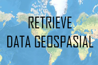

**Rangkuman Pertemuan 3 Sistem Informasi Geografis**

  

Resume Pertemuan 4 Sistem Informasi Geospasial

Latar Belakang Masalah

Pada sistem informasi geografis kita bisa melakukan beberapa hal dengan menggunakan data geospasial, salah satunya retrieve data geospasial

1. Apa yang dimaksud retrieve?
2. Apa itu shapefile?
3. Apa itu shp?
4. Apa itu dbf?

Pada data geospasial terdapat retrieve, yang dimaksud retrieve disini adalah bagian dari manipulasi data yang digunakan untuk melihat isi data pada geosapasial berupa data vektor yaitu yang berbentuk shapefile yang diluncurkan oleh ESRI dengan extensi .shp

Shapefile merupakan format data non topologi yang mudah dan sederhana yang berfungsi untuk menyimpan data lokasi geometric dan atribut informasi dari sebuah data geografis

SHP merupakan salah satu bentuk file yang terletak didalam shapefile yang menyimpan data dari geometri. Pada file SHP ini terdapat Bbox, Point dan Shapetype

Membaca jumlah data geometri

- --import shapefile
- --sf = shapefile.Reader(&quot;namafile.shp&quot;)
- --sf.shapes()
- --a = sf.shapes()
- --print len(a)

DBF merupakan sebuah file yang dapat menyimpan file tabular dan menyimpan data atribut

Membaca data DBF

- --import shapefile
- --sf.records()
- --sf.records(n)

Penutup

Kesimpulan

Dari pernyataan diatas dapat disimpulkan bahwa untuk memanipulasi data pada data geospasial cukup dengan menggunakan aplikasi QGIS dan pyshp pada pemrograman Python

Saran

Saran saya sebaiknya praktikum diatas bisa digunakan untuk mengasah kemampuan dalam memanipulasi data geospasial

* Nama : Maizar Fernando
* NPM : 1144109
* Kelas : 3C
* Prodi : D4 Teknik Informatika
* Mata Kuliah : Sistem Informasi Geografis

Link Github : https://github.com/maizar08/sisteminformasigeografis
Referensi : https://en.wikipedia.org/wiki/Shapefile

Scan Plagiarisme

1. smallseotools - Link https://drive.google.com/open?id=0B5gySyqZ4GGodEFrT0pBOThxMFU
2. searchenginereport - Link https://drive.google.com/open?id=0B5gySyqZ4GGoZTQzQXZVWnQwdms