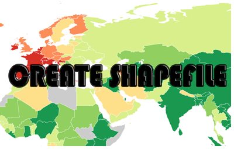

**Rangkuman Pertemuan 5 Sistem Informasi Geografis**

  

Latar Belakang Masalah

Pada sistem informasi geografis terdapat data geospasial, didalam data geospasial ini ada data vektor dan data raster. Di data vektor kita bisa melakukan create data shapefile

1. Apa itu Shapefile?
2. Apa yang digunakan untuk melakukan create shapefile?
3. Apa saja file yang ada pada shapefile?
4. Bagaimana cara menambahkan record?

Shapefile adalah format non topologi yang mudah dan sederhana yang berfungsi untuk menyimpan lokasi geometric dan atribut informasi dari sebuah data geografis

Yang digunakan untuk melakukan penambahan shapefile dengan meggunakan python dan plugin pyshp, dengan cara &#39;import shapefile&#39; dan inisialisasi &#39;a=Shapefile.Writer()&#39; pada python

Pada shapefile terdapat SHP dan DBF, pada SHP terdapat 3 tipe shapefile yaitu, Point, Polyline dan Polygon sedangkan pada DBF, pertama field untuk atribut tabel, contoh &#39;a=field(&#39;kata&#39;,&#39;C&#39;,&#39;40&#39;)&#39;, kedua isinya pada method, contoh &#39;a.record(&#39;bandung&#39;)&#39;, ketiga a.save(&#39;file.shp&#39;) dimana file.shp nama file shapefie yang sebelumnya diinputkan

Cara menambahkan record

1. Pada Point = &#39;a.point(x,y)&#39; atau &#39;a.point(x,y,0,0)&#39; dengan domain x dan y adalah koordinat
2. Pada Polyline = &#39;a.poly(shapefile=3,parts=[[[x1
,y1
,z1
,w1
],[ x2
,y2
,z2
,w2
],[……]]])&#39;
3. Pada Polygon = &#39;a.poly)shapefile=5,parts=[[[…….],[…….]]])&#39;

Penutup

Kesimpulan

Pada pernyataan diatas dapat disimpulkan bahwa untuk menambahkan shapefile menggunakan python dan pyshp sangat mudah dan coding yang digunakan sangat simple sehingga mudah diingat

Saran

Sebaiknya apa yang kita pelajari dalam penambahan shapefle dapat kita implementasikan agar bisa menambah kemampuan dalam sistem informasi geografis

* Nama : Maizar Fernando
* NPM : 1144109
* Kelas : 3C
* Prodi : D4 Teknik Informatika
* Mata Kuliah : Sistem Informasi Geografis

Link Github : https://github.com/maizar08/sisteminformasigeografis

Referensi : 

1. https://en.wikipedia.org/wiki/Shapefile
2. http://gis.stackexchange.com/questions/85448/python-how-to-create-a-polygon-shapefile-from-a-list-of-x-y-coordinates

Scan Plagiarisme

1. smallseotools - Link https://drive.google.com/open?id=0B5gySyqZ4GGoQ0dUZF9obHlFQlU
2. searchenginereport - Link https://drive.google.com/open?id=0B5gySyqZ4GGoc28yMlNTT2lZa3M